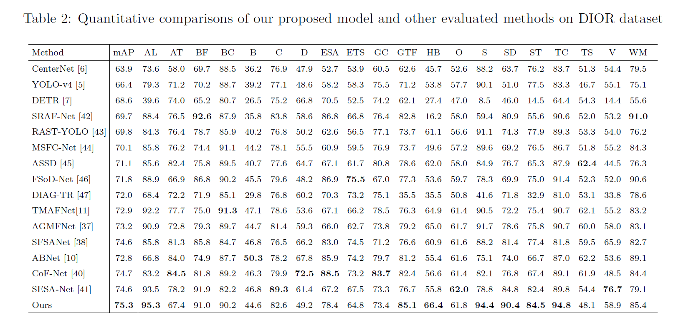
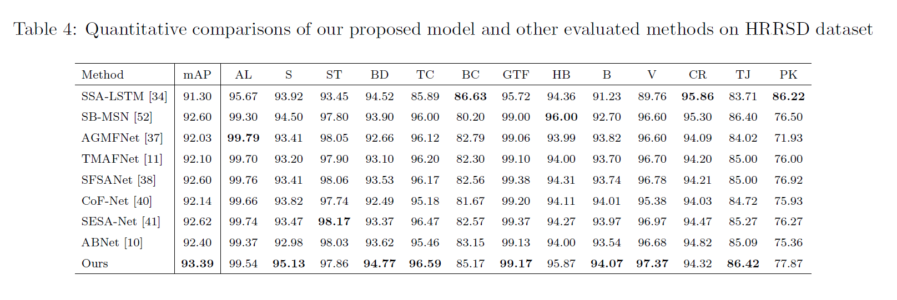
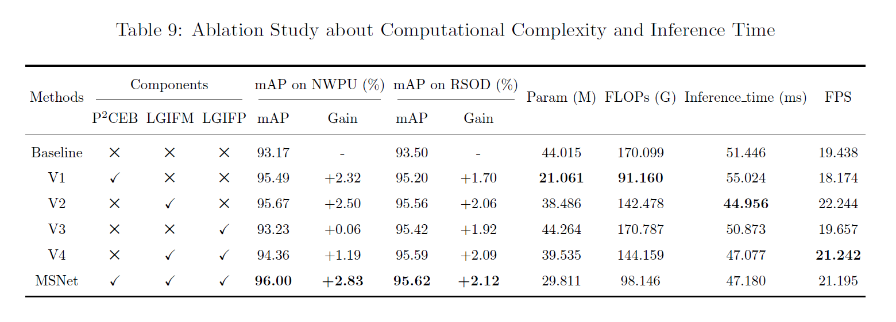

# [MSNet: Multi-Scale Network for Object Detection in Remote Sensing Images](https://www.sciencedirect.com/science/article/pii/S0031320324007349)
<a href="https://scholar.google.com/citations?hl=zh-CN&user=n43ejvQAAAAJ">Tao Gao</a><sup><span>1,2,*</span></sup>, 
Shailin Xia<sup><span>2,🌟</span></sup>, 
<a href="https://orcid.org/0000-0002-5696-5237">Mengkun Liu<a><sup><span>1,📧</span></sup>, 
<a href="https://scholar.google.com/citations?hl=zh-CN&user=Qa1DMv8AAAAJ">Jing Zhang</a><sup><span>3</span></sup>, 
<a href="https://orcid.org/0000-0002-8134-6913">Ting Chen<a><sup><span>2</span></sup>,
<a href="https://scholar.google.com/citations?hl=zh-CN&user=VBmXYq4AAAAJ">Ziqi Li</a><sup><span>2</span></sup>

\* Equal contribution 🌟 Project lead 📧 Corresponding author

---

<sup>1</sup> School of Data Science and Artifical Intelligence, Chang'an University,Xi'an 710064, China  
<sup>2</sup> School of Information Engineering, Chang'an University, Xi'an 710064, China  
<sup>3</sup> School of Computing, The Australian National University, Canberra, ACT 2600, Australia

---

<div align="center">

[](https://www.sciencedirect.com/science/article/pii/S0031320324007349) [](https://github.com/ShailinXia/MSNet)
</div>

---


## Abstract

Remote sensing object detection (RSOD) encounters challenges in effectively extracting features of small objects in remote sensing images (RSIs). To alleviate these problems, we proposed a Multi-Scale Network for Object Detection in Remote Sensing Images (MSNet) with multi-dimension feature information. Firstly, we design a Partial and Pointwise Convolution Extraction Module (P<sup>2</sup>CEM) to capture feature of object in spatial and channel dimension simultaneously. Secondly, we design a Local and Global Information Fusion Module (LGIFM), designed local information stack and context modeling module to capture texture information and semantic information within the multi-scale feature maps respectively. Moreover, the LGIFM enhances the ability of representing features for small objects and objects within complex backgrounds by allocating weights between local and global information. Finally, we introduce Local and Global Information Fusion Pyramid (LGIFP). With the aid of the LGIFM, the LGIFP enhances the feature representation of small object information, which contributes to dense connection across the multi-scale feature maps. Extensive experiments validate that our proposed method outperforms state-of-the-art performance. Specifically, MSNet achieves mean average precision (mAP) scores of 75.3\%, 93.39\%, 96.00\%, and 95.62\% on the DIOR, HRRSD, NWPU VHR-10, and RSOD datasets, respectively.

## Highlights

- **Innovative Feature Extraction**: Introduction of the Partial and Point-wise Convolution Extraction Module for simultaneous extraction of spatial and channel features, improving discrimination between object categories while conserving computational resources.
- **Enhanced Feature Fusion**: Implementation of the Local and Global Information Fusion Module to effectively integrate context modeling and residual modules, resulting in improved feature representation for small objects and background noise suppression.
- **Hierarchical Information Fusion**: Introduction of the Local and Global Information Fusion Pyramid to capture feature map information from different hierarchical levels, enabling better fusion of multi-scale information and enhancing feature representation across various scales.
- **Significant Contribution to RSOD**: The MSNet offers a comprehensive solution to the challenges of Remote Sensing Object Detection, particularly in feature extraction and fusion for small objects within complex backgrounds, thus advancing the state-of-the-art in remote sensing technology.

## Architecture

The architecture of MSNet is shown as follows:
<div style="text-align: center;">
	
</div>
<br>

The architecture of P<sup>2</sup>CEB is shown as follows:
<div style="text-align: center;">
	
</div>

## Comparison with other methods


The comparison with DIOR dataset is shown as follows:
<div style="text-align: center;">
	
</div>
<br>

The comparison with HRRSD dataset is shown as follows:
<div style="text-align: center;">
	
</div>

## Ablation

The ablation study about computational complexity and inference time are shown as follows:
<div style="text-align: center;">
	
</div>

## Dependencies
```python
torch
torchvision
tensorboard
scipy==1.2.1
numpy==1.17.0
matplotlib==3.1.2
opencv-python==4.1.2.30
tqdm==4.60.0
pillow==8.2.0
h5py==2.10.0
```

## Train and test
MSNet is trained on NWPU, RSOD, DIOR, HRRSD datasets, prepare them for training and testing. You can also use your datasets, meanwhile change the path to yours.

After that, you can train and test the MSNet by

```shell
cd SourceFile

python train.py [--parameters]
```

## Results
If you want to see the results of the model, you can run the following command:

```shell
cd SourceFile

python get_map.py [--parameters]
```

## Quick test
pre-trained weights can be found at SourceFile/logs, meanwhile change the path to yours. you can test the MSNet by

```shell
cd SourceFile

python predict.py
```

## Citation
If you find this project useful in your research, please consider citing:

```
@article{GAO2024110983,
title = {MSNet: Multi-Scale Network for Object Detection in Remote Sensing Images},
journal = {Pattern Recognition},
pages = {110983},
year = {2024},
issn = {0031-3203},
doi = {https://doi.org/10.1016/j.patcog.2024.110983}
}
```

## Contact us
Please contact us if there are any questions or suggestions (shailinxia666@gmail.com).